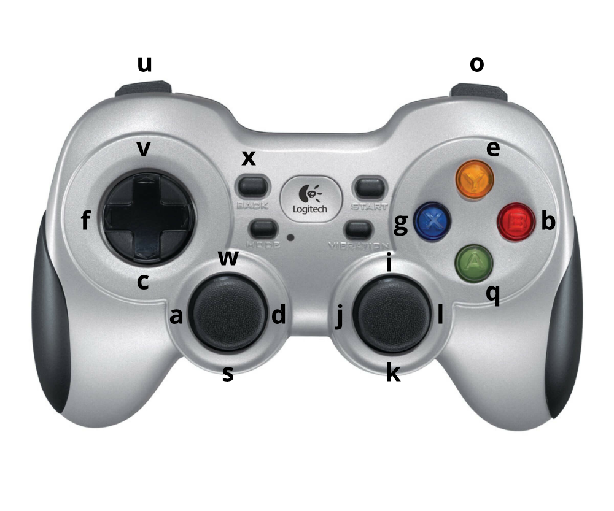

# The Treachery of Images: Bayesian Scene Keypoints for Deep Policy Learning in Robotic Manipulation

Repository providing the source code for the paper "The Treachery of Images: Bayesian Scene Keypoints for Deep Policy Learning in Robotic Manipulation ", see the [project website](http://bask.cs.uni-freiburg.de/).

Please cite the paper as follows:

    @article{vonHartz2023treachery,
    title={The Treachery of Images: Bayesian Scene Keypoints for Deep Policy Learning in Robotic Manipulation},
    author={von Hartz, Jan Ole and Chisari, Eugenio and Welschehold, Tim and Burgard, Wolfram and Boedecker, Joschka and Valada, Abhinav},
    journal={arXiv preprint arXiv:2305.04718},
    year={2023}
    }


# License
For academic usage, the code is released under the GPLv3 license. For any commercial purpose, please contact the authors.

This code further builds on code released by the following projects.
Please also consider citing these, if you use relevant parts of the code.

- BVAE: https://github.com/AntixK/PyTorch-VAE (Apache)
- CEILING: https://github.com/robot-learning-freiburg/CEILing (GPL)
- DON: https://github.com/RobotLocomotion/pytorch-dense-correspondence (BSD)
- MONet: https://github.com/baudm/MONet-pytorch (BSD, multiple of them)
- Pytorch3D: https://github.com/facebookresearch/pytorch3d (BSD)
- Transporter: https://github.com/ethanluoyc/transporter-pytorch (No license yet, thus excluded from this release.)
- TSDF Fusion: https://github.com/andyzeng/tsdf-fusion-python (BSD)

# Installation
## Python
Developed with Python 3.8.8.
We recommend using a conda environment.


## Simulation Experiments
- For the RLBench experiments you need to download the CoppeliaSim simulator. RLBench requires version **4.1** of CoppeliaSim:
    - [Ubuntu 16.04](https://www.coppeliarobotics.com/files/CoppeliaSim_Edu_V4_1_0_Ubuntu16_04.tar.xz)
    - [Ubuntu 18.04](https://www.coppeliarobotics.com/files/CoppeliaSim_Edu_V4_1_0_Ubuntu18_04.tar.xz)
    - [Ubuntu 20.04](https://www.coppeliarobotics.com/files/CoppeliaSim_Edu_V4_1_0_Ubuntu20_04.tar.xz)

    For Debian 11 and Ubuntu 22.04, you can use the Ubuntu 20.04 package.

    Download the archive .tar.gz, unpack it (eg. to /opt/). Test by running ./coppeliasim.sh in the unpacked directory.

    Add the following to your *~/.bashrc* file: (__NOTE__: the 'EDIT ME' in the first line)

    ```bash
    export COPPELIASIM_ROOT=EDIT/ME/PATH/TO/COPPELIASIM/INSTALL/DIR
    export LD_LIBRARY_PATH=$LD_LIBRARY_PATH:$COPPELIASIM_ROOT
    export QT_QPA_PLATFORM_PLUGIN_PATH=$COPPELIASIM_ROOT
    ```

    Remember to source your bashrc (`source ~/.bashrc`) or zshrc (`source ~/.zshrc`) after this.

- Create your virtual environment and install Python and Pytorch. We used Conda as following:

    ```bash
    conda create --name bask_env
    conda activate bask_env
    conda install python=3.8.8
    ```

    To run on a GPU, make sure pytorch is installed with CUDA support.
    ```bash
    pip freeze | grep torch
    # If there is no +cu following the version number, reinstall torch.
    pip install torch==1.7.1+cu92 torchvision==0.8.2+cu92 -f https://download.pytorch.org/whl/torch_stable.html
    ```
    For new GPUs (with CUDA 11), you might need to bump Torch:
    `pip install torch==1.8.2+cu111 torchvision==0.9.2+cu111 torchaudio==0.8.2 -f https://download.pytorch.org/whl/lts/1.8/torch_lts.html`

    For CUDA 10.1, use:
    `pip install torch==1.8.1+cu101 torchvision==0.9.1+cu101 torchaudio==0.8.1 -f https://download.pytorch.org/whl/torch_stable.html`

- Install PyRep from https://github.com/stepjam/PyRep

- Install RLBench fork from https://github.com/vonHartz/RLBench

- Install some final dependencies:

    ```bash
    pip install -r requirements.txt
    ```

    If there's a problem installing Pycuda, try `export PATH=/usr/local/cuda-11.1/bin:$PATH`.

You should be good to go!

If `nvcc` cannot be found, run `export PATH=$PATH:/usr/local/cuda-11.1/bin/`.

- For the supplementary generalization experiment, install ManiSkill2: https://github.com/vonHartz/ManiSkill2

## GPU-accelerated Point Cloud Clustering
- When you want to train a DON on a multi-object scene without ground truth labels, you need to cluster the reconstructed point clouds. To use GPU-accelerated clustering from cuML, set up your env as:

   ```bash
   conda create -n cuml_env -c rapidsai -c nvidia -c conda-forge rapids=22.04 python=3.8.8
   export CUDA_PATH=/usr/local/cuda-11.1
   export LD_LIBRARY_PATH=$CUDA_PATH/lib64:$LD_LIBRARY_PATH
   ```
   See: https://rapids.ai/start.html#rapids-release-selector
   Note that you might need to adapt the cuda path.
   It is also advised to use a separate env for cuML to avoid version conflicts.

   If `cupy` makes issue, uninstall via pip and install the correct version, see https://docs.cupy.dev/en/latest/install.html#installing-cupy-from-pypi

   Then follow the instructions as usual.

## Real Robot
- For the real-robot experiments, you need to install ROS. Please make sure to adapt `env/franka.py` to your real-robot setup. It relies on installed realsense drivers, [RobotIO](https://arxiv.org/abs/2207.13591) and a running Franka state descriptor.


# Teleoperation

In order to teleoperate the robot, the keyboard can be used. The key mappings are the following:

    c -> close gripper
    v -> open gripper
    x -> reset episode
    y -> reset and save trajectory
    a -> move left
    d -> move right
    s -> move backward
    w -> move forward
    q -> move down
    e -> move up
    j -> look left
    l -> look right
    i -> look up
    k -> look down
    u -> rotate left
    o -> rotate right

Nevertheless, we suggest using a gamepad for easier control. We used `qjoypad` to map the gamepad commands to the right keyboard key. The mapping we suggest are the following:



Install `qjoypad` from apt, import the mapping file in this repo and save. After starting the teleoperation script, launch `qjoypad --notray` in another bash.

# Usage

## General

To use BASK, the general workflow is as follows.

- Collect pretraining data:
```
python src/teleoperation_env.py -p manual --pretrain -m -o -t PickSingleYCB-v0 --model_ids 065-a_cups -e maniskill -n 20
```

- Pretrain the Dense Object Net:

```
python src/pretrain.py --config configs/maniskill-ycb-cups-pretrain.py -f cloning -m -o -t PickSingleYCB-v0-065-a_cups -e keypoints --cam base

python src/visualize_dense_correspondence.py --config configs/maniskill-ycb-cups-pretrain.py -f cloning -m -o -t PickSingleYCB-v0-065-a_cups --cam base
```

Note that on real world data (or simulated data without object masks), you need to run `python src/tsdf_fusion.py` first.

- Collect policy demonstrations:
```
python src/teleoperation_env.py -p manual -m -o -t PickSingleYCB-v0 --model_ids 065-a_cups -e maniskill
```

- You can embed the demonstrations using the encoder before training. Doing this once instead of online during policy learning reduces computational cost by orders of magnitude.
```
python src/embed_trajectories.py -f cloning -m -o -t PickSingleYCB-v0-065-a_cups -e keypoints --cam base --pretrain_feedback dcm --config configs/maniskill-ycb-cups-pretrain.py

python src/kp_encode_trajectories.py -f cloning -m -o -t PickSingleYCB-v0-065-a_cups --cam base --pretrain_feedback dcm --config configs/maniskill-ycb-cups-pretrain.py --selection_name my-kp-selection
```

- Policy learning
```
python src/behavior_cloning.py -f cloning -m -o -t PickSingleYCB-v0-065-a_cups -p encoder -e keypoints --cam base --pretrain_feedback dcm --config configs/maniskill-ycb-cups-pretrain.py --kp_pre_complete my-kp-selection
```

- Evaluation
```
python src/evaluate.py -f cloning -m -o -t PickSingleYCB-v0-065-a_cups -p encoder -e keypoints --cam base --config configs/maniskill-ycb-cups-pretrain.py
```


## Model Checkpoints

You can download our pretrained model checkpoints by clicking the links below. Afterwards place them in `<data_root>/<task>/`.
For additional checkpoints, please contact the authors.

[BASK on Microwave](bask.cs.uni-freiburg.de/datasets/cloning_keypoints_pon-CloseMicrowave_policy.pt)
[BASK on Lid](bask.cs.uni-freiburg.de/datasets/cloning_keypoints_pon-TakeLidOffSaucepan_policy.pt)
[BASK on Phone](bask.cs.uni-freiburg.de/datasets/cloning_keypoints_pon-PhoneOnBase_policy.pt)
[BASK on Rubbish](bask.cs.uni-freiburg.de/datasets/cloning_keypoints_pon-PutRubbishInBin_policy.pt)


